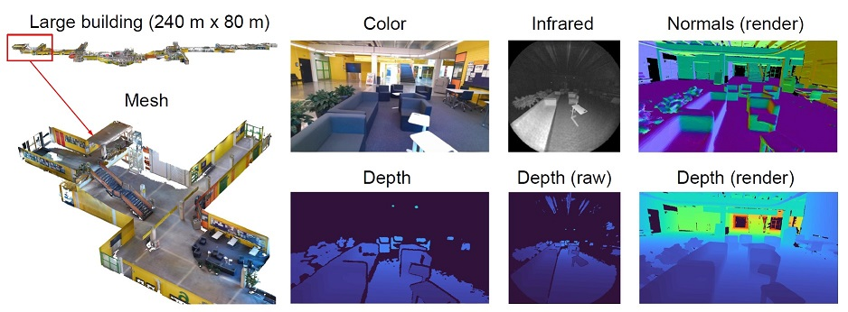
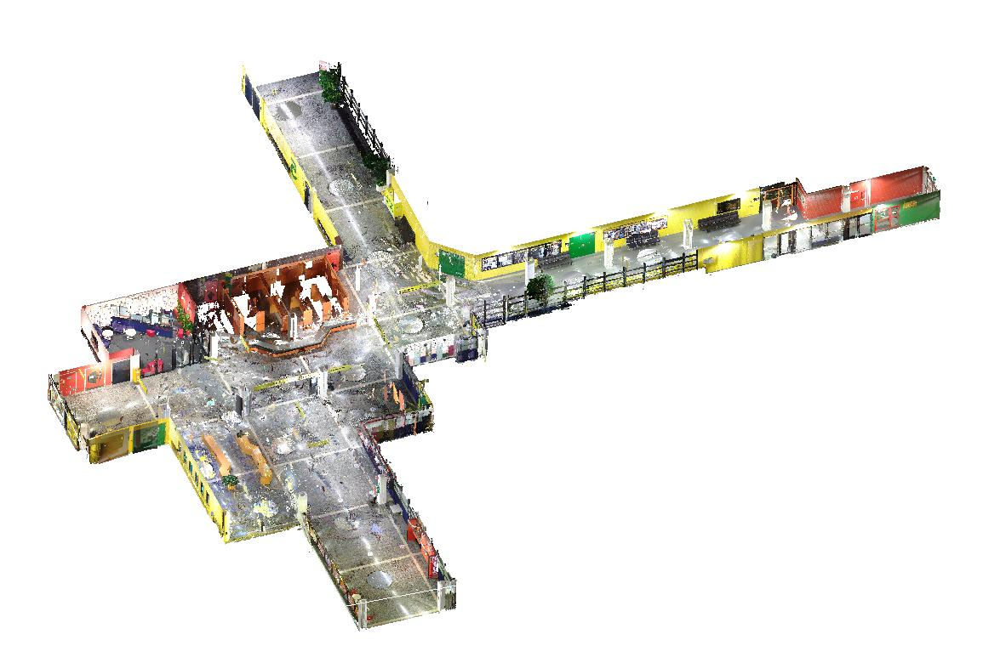

# BS3D: Building-scale 3D Reconstruction from RGB-D Images
The BS3D dataset and the reconstruction framework presented in:  
*BS3D: Building-scale 3D Reconstruction from RGB-D Images* [[arXiv](https://arxiv.org/pdf/2301.01057.pdf)]    

# 1. BS3D dataset
The BS3D dataset can be downloaded from [[**here**](https://doi.org/10.23729/0100cfe8-3264-4bd9-b1cd-937c1880cdc2)]. The following sections describe the contents of the dataset.

## 1.1 Campus reconstruction (2 Hz)
The main reconstruction is under the **campus** subdirectory.
Images are provided in two coordinate frames: color camera and depth (infrared) camera. For this part, lasers scans were not captured. There are 19981 images which have been rectified. A filename corresponds to the timestamp in seconds.

### Color camera frame
<table>
  <tr>
    <th align="left">Type</th>
    <th align="left">Resolution</th>
	<th align="left">Format</th>
	<th align="left">Description</th>
	<th align="left">Identifier</th>
  </tr>
  <tr>
    <td>Color images</td>
    <td>720x1280</td>
    <td>24-bit JPG</td>
    <td>Rectified color images.</td>
	<td>color</td>
  </tr>
    <tr>
    <td>Depth maps</td>
    <td>720x1280</td>
    <td>16-bit PNG</td>
    <td>Sensor depth in millimeters. Invalid depth equals 0.</td>
	<td>depth</td>
  </tr>
  </tr>
    <tr>
    <td>Depth maps (rendered)</td>
    <td>720x1280</td>
    <td>16-bit PNG</td>
    <td>Depth rendered from the mesh in millimeters. Invalid depth equals 0.</td>
	<td>depth_render</td>
  </tr>
  </tr>
    <tr>
    <td>Normal maps (rendered)</td>
    <td>720x1280</td>
    <td>24-bit PNG</td>
    <td>Surface normals rendered from the mesh. Invalid normal equals (0,0,0).</td>
	<td>normal_render</td>
  </tr>
  </tr>
    <tr>
    <td>Camera poses</td>
    <td></td>
    <td>TXT</td>
    <td>Color camera poses (camera-to-world) in the RGBD SLAM format:  timestamp, tx, ty, tz, qx, qy, qz, qw</td>
	<td>poses</td>
  </tr>
  </tr>
    <tr>
    <td>Camera calibration</td>
    <td></td>
    <td>YAML</td>
    <td>Color camera intrinsics and extrinsics between color and infrared camera.</td>
	<td>calibration</td>
  </tr>
</table>

### Depth camera frame
<table>
  <tr>
    <th align="left">Type</th>
    <th align="left">Resolution</th>
	<th align="left">Format</th>
	<th align="left">Description</th>
	<th align="left">Identifier</th>
  </tr>
  <tr>
    <td>Color images</td>
    <td>1024x1024</td>
    <td>24-bit JPG</td>
    <td>Color images transformed to the depth camera frame.</td>
	<td>color</td>
  </tr>
    <tr>
    <td>Infrared images</td>
    <td>512x512</td>
    <td>16-bit PNG</td>
    <td>Active infrared images.</td>
	<td>infrared</td>
  </tr>
    <tr>
    <td>Depth maps</td>
    <td>512x512</td>
    <td>16-bit PNG</td>
    <td>Raw sensor depth in millimeters. Invalid depth equals 0.</td>
	<td>depth</td>
  </tr>
  </tr>
    <tr>
    <td>Depth maps (rendered)</td>
    <td>512x512</td>
    <td>16-bit PNG</td>
    <td>Depth rendered from a mesh in millimeters. Invalid depth equals 0.</td>
	<td>depth_render</td>
  </tr>
  </tr>
    <tr>
    <td>Normal maps (rendered)</td>
    <td>512x512</td>
    <td>24-bit PNG</td>
    <td>Surface normals rendered from a mesh. Invalid normal equals (0,0,0).</td>
	<td>normal_render</td>
  </tr>
  </tr>
    <tr>
    <td>Point clouds</td>
    <td></td>
    <td>PLY</td>
    <td>Point cloud data (X,Y,Z) including infrared intensity.</td>
	<td>clouds</td>
  </tr>
  </tr>
    <tr>
    <td>Camera poses</td>
    <td></td>
    <td>TXT</td>
    <td>Depth camera poses (camera-to-world) in the RGBD SLAM format:   timestamp, tx, ty, tz, qx, qy, qz, qw</td>
	<td>poses</td>
  </tr>
  </tr>
    <tr>
    <td>Camera calibration</td>
    <td></td>
    <td>YAML</td>
    <td>Depth camera intrinsics and extrinsics between color and infrared camera.</td>
	<td>calibration</td>
  </tr>
</table>

### Inertial measurements
<table>
  <tr>
    <th align="left">Type</th>
    <th align="left">Rate</th>
	<th align="left">Format</th>
	<th align="left">Description</th>
	<th align="left">Identifier</th>
  </tr>
  <tr>
    <td>IMU data and calibration</td>
    <td>1.6 kHz</td>
    <td>CSV, YAML</td>
    <td>Accelerometer (m/s^2) and gyroscope readings (rad/s) sampled at 1.6 kHz. Format: stamp, wx, wy, wz, ax, ay, az. Calibration includes IMU-camera extrinsics (e.g. between gyroscope and color camera).</td>
	<td>imu</td>
</table>

### Surface reconstruction
<table>
  <tr>
    <th align="left">Type</th>
	<th align="left">Format</th>
	<th align="left">Description</th>
	<th align="left">Identifier</th>
  </tr>
  <tr>
    <td>Mesh</td>
    <td>PLY</td>
    <td>Mesh created from raw depth maps using scalable TSDF fusion (Open3D library). No color information.</td>
	<td>mesh</td>
</table>

### Raw recordings
Raw recordings are in the **mkv** directory. There are 47 recordings (6.7GB - 11.6 GB each) which you can extract using **preprocess-mkv.exe** (Section 2). You may want to discard a few seconds at the beginning/end of the recording since the device is stationary.

## 1.2 Lobby reconstruction with laser scans (2 Hz)
A reconstruction of a lobby and corridors is under the **lobby** subdirectory. Data is organized as described above. There are 6618 images in total. In addition, the data includes laser scans that were obtained using FARO 3D X 130.

### Laser scans
<table>
  <tr>
    <th align="left">Type</th>
	<th align="left">Format</th>
	<th align="left">Description</th>
	<th align="left">Identifier</th>
  </tr>
  <tr>
    <td>Original scans</td>
    <td>PLY</td>
    <td>Original laser scans (point clouds) which have been registered. Clouds have not been cleaned or downsampled.</td>
	<td>laserscans_original</td>
  </tr>
  <tr>
    <td>Cleaned scan</td>
    <td>PLY</td>
    <td>A single point cloud that has been cleaned and downsampled.</td>
	<td>laserscan</td>
</table>

## 1.3 Odometry sequences (30 Hz)
Sequences used in the visual-inertial odometry experiments. See the tables above for the description of the data. Note that lasers scans were not captured.

<table>
  <tr>
    <th>Sequence</th>
    <th>Duration (s)</th>
    <th>Length (m)</th>
    <th>Dimensions (m)</th>
  </tr>
  <tr>
    <td>cafeteria</td>
    <td>200</td>
    <td>90.0</td>
	<td>12.4 x 15.7 x 0.8</td>
  </tr>
  <tr>
    <td>central</td>
    <td>242</td>
    <td>155.0</td>
	<td>25.5 x 42.1 x 5.3</td>
  </tr>
  <tr>
    <td>dining</td>
    <td>192</td>
    <td>109.2</td>
	<td>33.8 x 25.0 x 5.5</td>
  </tr>
  <tr>
    <td>corridor</td>
    <td>174</td>
    <td>77.6</td>
	<td>31.1 x 4.7 x 2.4</td>
  </tr>
  <tr>
    <td>foobar</td>
    <td>75</td>
    <td>37.1</td>
	<td>5.4 x 14.4 x 0.6</td>
  </tr>
  <tr>
    <td>hub</td>
    <td>124</td>
    <td>52.3</td>
	<td>11.4 x 5.9 x 0.7</td>
  </tr>
  <tr>
    <td>juice</td>
    <td>103</td>
    <td>42.7</td>
	<td>6.3 x 8.6 x 0.5</td>
  </tr>
    <tr>
    <td>lounge</td>
    <td>222</td>
    <td>94.2</td>
	<td>14.4 x 10.3 x 1.1</td>
  </tr>
  </tr>
    <tr>
    <td>study</td>
    <td>87</td>
    <td>40.0</td>
	<td>5.6 x 9.8 x 0.6</td>
  </tr>
  </tr>
    <tr>
    <td>waiting</td>
    <td>139</td>
    <td>60.1</td>
	<td>9.8 x 6.7 x 0.9</td>
  </tr>
</table>

# 2. Reconstruction framework
Follow these instructions to reconstruct your environment. This repository includes a template dataset `datasets/mydataset` with necessary configuration files and folder structure.

## 2.1 Prerequisites

This software has been tested on **Windows 10**, but it should be compatible with Ubuntu 18.04.

- Install Azure Kinect SDK from [here](https://learn.microsoft.com/en-us/azure/kinect-dk/sensor-sdk-download) (version 1.4.1, latest)
- Install RTAB-Map from [here](https://github.com/introlab/rtabmap/releases) (version 0.20.16, latest)
- Install Preprocess-MKV (instructions below)

Clone the repository:

    git clone https://github.com/jannemus/BS3D.git
    cd BS3D

## 2.2 Install Preprocess-MKV
Preprocess-MKV is needed for extracting and processing the MKV files captured using Azure Kinect. Make sure you have installed the Azure Kinect SDK (see prerequisites). You also need [OpenCV 4.3.0](https://opencv.org/) (or later) and [CMake 3.18.2](https://cmake.org/download/) (or later).

In the following example, Visual Studio 2017 is used to compile Preprocess-MKV. Open the Visual Studio command prompt (Start -> VS2015 x64 Native Tools Command Prompt). To compile:

    mkdir preprocess\build
    cd preprocess\build
    cmake -G"Visual Studio 15 2017 Win64" ..
    cmake --build . --config Release --target install

## 2.3 Data capture
Azure Kinect SDK includes a recorder application (k4arecorder.exe) that is called from `record.py`. Record one or more sequences by running:

    python record.py output.mkv

Put your recordings (e.g. A1.mkv, A2.mkv, ...) to the *mydataset/mkv* folder.

**Capturing tips**
- To encourage loop closure detection, start and end the recording from a view that has plenty of visual features (corners etc.).
- During recording, it is good to revisit  locations, especially those that are rich in visual features.
- Although Azure Kinect has a fairly good depth range and FoV, avoid pointing the camera towards a view that has insufficient geometry (e.g. large and completely empty lobby or corridor).

## 2.4 Preprocess MKVs
Extract images (color, depth, infrared), inertial measurements, point clouds, and calibration information from the MKV files using `preprocess.py`. The code will also undistort the images and perform color-to-depth alignment (C2D). The command:

    python preprocess.py datasets/mydataset

will process all MKV files and write data to *mydataset/preprocessed/\*/*, where * is the name of the MKV file. RTAB-Map configuration files will also be written to *mydataset/rtabmap/*.

**Note** If you just want to extract data, you can provide arguments `--undistort false` and `--c2d false`.

## 2.5 Single-session mapping
Launch RTAB-Map and load configuration from *mydataset/rtabmap/\*/single-session-config.ini*, where * is the session name.  
`Preferences -> Load settings (*.ini)`
This will automatically set paths to calibration, color images and depth maps.

Initialize database `File -> New database` and press start. After the reconstruction has finished, check that the map looks good. If it does, close the database (.db) to save it to *mydataset/rtabmap/\*/map.db* If you have multiple sessions, process and save each of them. Make sure you name each database *map.db*.

If you only have a single session, export camera poses to *mydataset/rtabmap/poses.txt*  
`File -> Export poses -> RGBD-SLAM format (*.txt) -> Frame: Camera`  
After that, continue to Sec. 1.7 Surface reconstruction.

## 2.6 Multi-session mapping

In RTAB-Map, load configuration *mydataset/rtabmap/multi-session-config.ini*  

Select all single-session databases:  
`Preferences -> Source -> Database > [...] button`

**Note** that the order in which the databases are processed matters (A1.db, A2.db, ..., C3.db). For example, the sequence C3.db should overlap at least one of the earlier sequences (A1.db, A2.db, ...).

Initialize database `File -> New database` and press start. After the reconstruction has finished, check that the map looks good. If it does, export camera poses to *mydataset/rtabmap/poses.txt*  
`File -> Export poses -> RGBD-SLAM format (*.txt) -> Frame: Camera`

**Optionally** you can perform post-processing to detect more loop closures:  
`Tools -> Post-processing -> OK (default settings)`  
after which you need to export poses again.

## 2.7 Surface reconstruction
Perform surface reconstruction using TSDF fusion:

    python meshing.py datasets/mydataset
    
The output mesh (.ply) will be written to *mydataset/mesh* by default.

## 2.8 Render images
Render depth maps and surface normals from the mesh:

    python render.py datasets/mydataset

The output data will be written to *mydataset/render* by default.

## Citation
If you use this repository in your research, please consider citing:

    @article{mustaniemi2023bs3d,
      title={BS3D: Building-scale 3D Reconstruction from RGB-D Images},
      author={Mustaniemi, Janne and Kannala, Juho and Rahtu, Esa and Liu, Li and Heikkil{\"a}, Janne},
      journal={arXiv preprint arXiv:2301.01057},
      year={2023}
    }
